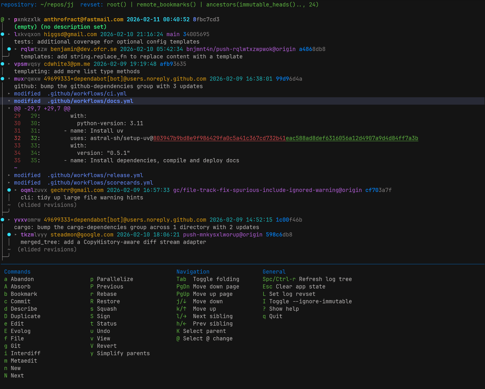

# jjdag



A Rust TUI to manipulate the [Jujutsu](https://github.com/jj-vcs/jj) DAG.

Inspired by the great UX of [Magit](https://magit.vc/).

---

## 🙏 Acknowledgements

**Huge thanks to [anthrofract](https://github.com/anthrofract/jjdag) for creating the original jjdag!**

This project is a fork of their excellent work. They built the foundation — the TUI framework, the core command system, the log tree visualization, and much more. Without their pioneering effort, this fork wouldn't exist.

- **Original Repo**: https://github.com/anthrofract/jjdag

---

## What's New in This Fork

Since forking, we've made significant improvements across the entire application:

### Core UX Improvements

- **Inline Text Editing** — Replaced external editor prompts with TUI-based text input for revision descriptions (`dd`), bookmark creation (`bc`), revset editing, and various other prompts. This eliminates the context-switching pain of popping out to an external editor for simple inputs.
- **Text Prompt Popup** — for the cases where inline editing didn't make sense, popping up an external editor just to ask for a simple line of text (usually under a word!) was replaced with a TUI text propmt popup, for example when renaming bookmarks, workspaces, etc.
- **Fuzzy Popup System** — Added fuzzy searchable popups for 15+ command types including bookmark delete/rename/set/track/untrack, file track, git fetch remote/branch selection, and workspace forget/rename. No more typing bookmark names blindly into an external editor!
- **Easy Splitting** — The double-editor-opening issue with `split` command has been abolished: now, you can split, and then edit the resulting revisiond descriptions inline, without ever leaving the TUI

### Branch-Based Workflows (for GitHub and Git Users)

jj's bookmark system is powerful but can feel awkward for GitHub-style branch workflows. We added support for the common bookmark "tug" alias to make things a little easier, but then we added three more features to make it sing:

1. **Git Push & Tug Command** — A command that automates tugging a bookmark up to the current revision, then pushing to git, all in one go. Perfect for keeping GitHub in sync.
2. **New Revision on Bookmark** — Creates new revisions on top of the current revision and tugs the bookmark up in one command, automating "staying on a branch" conceptually.
3. **Resolve Command** — Launches external merge tools for conflict resolution directly from the TUI (essential for multi-person branch workflows).

### The Power-Workspace Workflow

"Power workspaces" are a layered workflow on top of jj's native workspace system that maintains an organized, structured, hierarchical workspace organization automatically.

- When you add your first additional workspace, it automatically "scoops up" your initial workspace into a `default/` subdirectory of the original project directory.
- All workspaces you add get their own sibling directories underneath the original project directory, next to the `default/` workspace, named after the workspace name.
- When you `forget` down to just `default`, it automatically "un-scoops" to restore standard structure as if it was never there.
- When you rename, both the workspace *and* the workspace directory are kept in sync.
- Jjdag allows you to easily move between workspaces without leaving it or breaking your flow.
- Jjdag also edits jj's internal binary database files to keep its knowledge in sync with what jjdag is doing.

### Command Additions & Improvements

- **Workspace Management** — Full support for `workspace add`, `workspace list`, `workspace forget`, `workspace rename`, `workspace root`, and `workspace update-stale` (both native and Power Workspace variants)
- **Ignore-Immutable Variants** — Commands like `describe` and `edit` that respect immutable revisions now have ignore-immutable variants (`d i` for describe ignoring immutability, `e i` for edit ignoring immutability)
- **Enter/Double-Click Improvements** — Jump to file with line number support for hunks

### Bug Fixes
- Fixed `jj git fetch` commands
- Various other bug fixes and stability improvements

---

## Installation

With cargo:
```sh
cargo install --git https://github.com/alexispurslane/jjdag
```

Or clone and build locally:
```sh
git clone https://github.com/alexispurslane/jjdag
cd jjdag
cargo install --path .
```

---

## Quick Start Guide

1. **Run jjdag**:
   ```sh
   jj
   ```

2. **Press `?`** to show the help overlay with all available commands.

3. **Navigation**:
   - `j` / `k` — Move up/down in the log tree
   - `h` / `l` — Collapse/expand commits
   - Enter — Select a commit or open a file
   - Mouse left-click — Select
   - Mouse right-click — Toggle folding
   - Scroll wheel — Scroll

4. **Common Commands**:
   - `cc` — Commit
   - `dd` — Describe (edit description)
   - `ss` — Squash into parent
   - `uu` — Undo last operation
   - `rr` — Redo
   - `ee` — Edit (checkout) revision
   - `ggp` — Git push (with subcommands like `a` for all, `t` for tracked)
   - `ggf` — Git fetch

5. **Multi-Key Sequences**:
   jjdag uses Magit-style key sequences. Type the first key, wait for the popup, then type the next key:
   - `g` + `p` + `a` → `jj git push --all`
   - `g` + `p` + `t` → `jj git push --tracked`
   - `b` + `c` → Create bookmark
   - `b` + `d` → Delete bookmark (with fuzzy search)

---

## Supported jj Commands

### Bookmarks
- `bookmark create`, `delete`, `forget`, `move`, `rename`, `set`, `track`, `untrack`, `list`

### Commits & History
- `abandon`, `absorb`, `commit`, `describe`, `duplicate`, `edit`, `new`, `next`, `prev`, `rebase`, `redo`, `restore`, `revert`, `sign`, `simplify-parents`, `squash`, `undo`, `unsign`

### Diff & File
- `diff`, `file track`, `file untrack`, `interdiff`

### Git
- `git fetch`, `git push`

### Other
- `evolog`, `parallelize`, `resolve`, `status`

### Workspace (Power Workflow)
- `workspace add`, `workspace forget`, `workspace list`, `workspace rename`, `workspace root`

---

## Missing Features

See the original project for the full roadmap. High-priority additions planned:
- `config` management
- `op log` (operation log)
- `tag` management
- `file annotate` (git blame)
- `sparse` checkouts
- `bisect`

---

## License

Same as the original — MIT.
